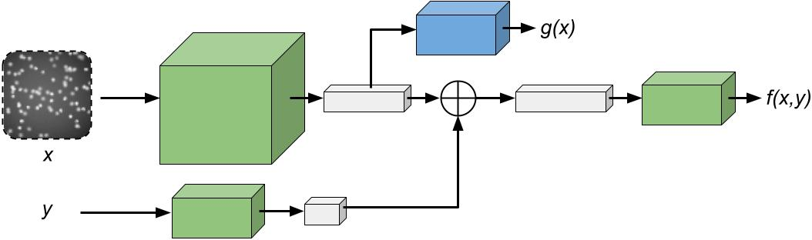

# ebms_proposals



Official implementation (PyTorch) of the paper: \
**Learning Proposals for Practical Energy-Based Regression**, AISTATS 2022 [[arXiv]](https://arxiv.org/abs/2110.11948) [[project]](http://www.fregu856.com/publication/ebms_proposals/). \
[Fredrik K. Gustafsson](http://www.fregu856.com/), [Martin Danelljan](https://martin-danelljan.github.io/), [Thomas B. Schön](http://user.it.uu.se/~thosc112/). \
_We derive an efficient and convenient objective that can be employed to train a parameterized distribution q(y|x; phi) by directly minimizing its KL divergence to a conditional EBM p(y|x; theta). We then employ the proposed objective to jointly learn an effective MDN proposal distribution during EBM training, thus addressing the main practical limitations of energy-based regression. Furthermore, we utilize our derived training objective to learn MDNs with a jointly trained energy-based teacher, consistently outperforming conventional MDN training on four real-world regression tasks within computer vision._

If you find this work useful, please consider citing:
```
@article{gustafsson2021learning,
  title={Learning Proposals for Practical Energy-Based Regression},
  author={Gustafsson, Fredrik K and Danelljan, Martin and Sch{\"o}n, Thomas B},
  journal={arXiv preprint arXiv:2110.11948},
  year={2021}
}
```


## Acknowledgements

- TODO!


## Index
- TODO!
***
***
***


***
***
***

Code will be released before the end of February.
